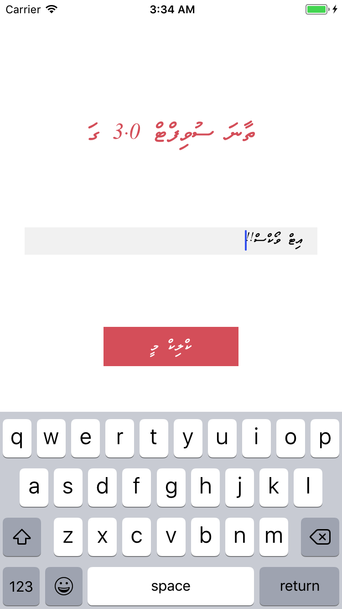

# ThaanaEditText

Its a simple class which is used to let the users input thaana characters to the edit text without any hassle. Thaana fonts has to be added
to the project and the info.plist must be updated before using this class.
